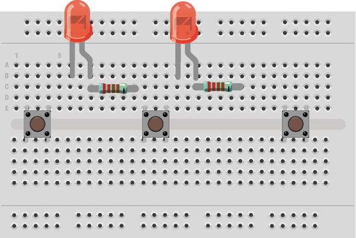
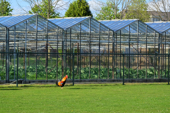
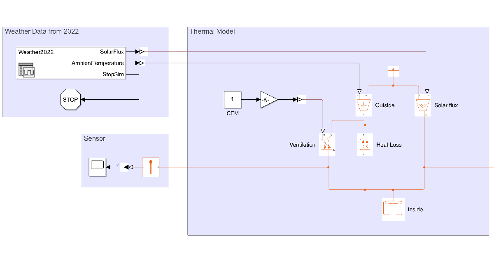
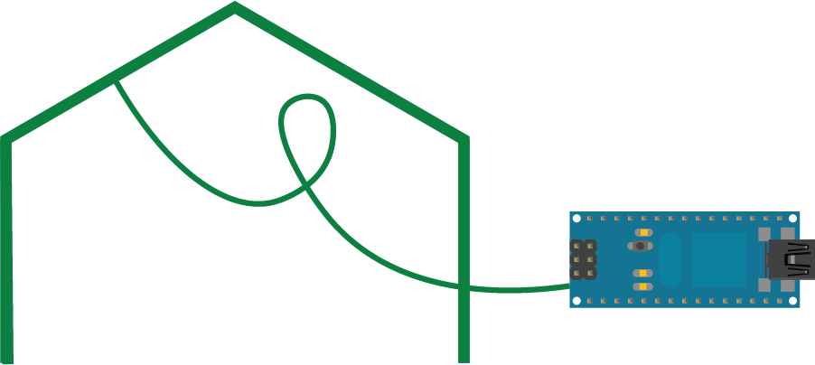
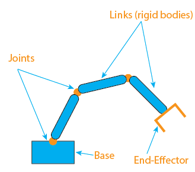

# Introduction to Engineering: 
# A Hands-On Exploration with Arduino

**Curriculum Module**

_Created with R2023b. Compatible with R2023b and later releases._

# Information

This curriculum module contains interactive [MATLAB® live scripts](https://www.mathworks.com/products/matlab/live-editor.html) introducing fundamental concepts of modern engineering using Arduino Hardware. The whole module is designed to explore these concepts using hardware using Arduino. You will explore the signals, data analysis, sensing, control and Internet of Things (IoT).

## Background

You can use these live scripts as demonstrations in lectures, class activities, or interactive assignments outside class. This module covers the concepts of signals, control, and technical writing. It also includes examples of the Internet of Things and physical modeling.

The instructions inside the live scripts will guide you through the exercises and activities. Get started with each live script by running it one section at a time. To stop running the script or a section midway (for example, when an animation is in progress), use the  Stop button in the **RUN** section of the **Live Editor** tab in the MATLAB Toolstrip.

## Contact Us

Solutions are available upon instructor request. Contact the [MathWorks teaching resources team](mailto:onlineteaching@mathworks.com) if you would like to request solutions, provide feedback, or if you have a question.

## Prerequisites

These scripts assume no prior knowledge of hardware programming and wiring. There is minimal MATLAB & Simulink knowledge required to complete the module. It is highly encouraged to follow online self-paced training to complete most of the activities:

-  [MATLAB Onramp](https://matlabacademy.mathworks.com/details/matlab-onramp/gettingstarted) 
-  [Simulink Onramp](https://matlabacademy.mathworks.com/details/simulink-onramp/simulink) 
-  [Stateflow Onramp](https://matlabacademy.mathworks.com/details/stateflow-onramp/stateflow) 

## Getting Started

Download this repository. Open MATLAB, navigate to the folder containing these scripts, and double-click on [intro-to-engineering.prj](matlab: openProject("intro-to-engineering.prj")). It will add the appropriate files to your MATLAB path and open an app that asks you where you would like to start. 

To clone this repository, you can copy and paste the following command directly into your MATLAB Command Window:

<pre>
gitclone("https://github.com/MathWorks-Teaching-Resources/Intro-To-Engineering.git")
</pre>

Ensure you have all the required products ([listed below](#H_E850B4FF)) installed. If you need to include a product, add it using the Add-On Explorer. To install an add-on, go to the **Home** tab and select   **Add-Ons** > **Get Add-Ons**. 

## Products

MATLAB®, Simulink®, Stateflow™, Symbolic Math Toolbox™, MATLAB Support package for Arduino, Simulink Support package for Arduino.

# Scripts

 *If you are viewing this in a version of MATLAB prior to R2023b, you can view the learning outcomes for each script* [*here.*](https://www.mathworks.com/matlabcentral/fileexchange/156477-introduction-to-engineering-with-arduino)

## [**SupportArduino.mlx**](https://matlab.mathworks.com/open/github/v1?repo=MathWorks-Teaching-Resources/Intro-To-Engineering&project=intro-to-engineering.prj&file=SupportArduino.mlx)
| | **In this script, students will...** |
| :-- | :-- |
|  |   -  Check their Arduino board compatibility.  -  Install MATLAB and Simulink support packages for Arduino Hardware.  -  Setup ThingSpeak channel for IoT.  |

## [BlinkToSOS.mlx](https://matlab.mathworks.com/open/github/v1?repo=MathWorks-Teaching-Resources/Intro-To-Engineering&project=intro-to-engineering.prj&file=BlinkToSOS.mlx)
| | **In this script, students will...** |
| :-- | :-- |
|  |-  Learn the fundamental type of signals supported on and Arduino board.  -  Wire a simple LED to their Arduino board.  -  Control the LED from a simple blink to encoding Morse code.  |

## [**ReactionAnalyzer.mlx**](https://matlab.mathworks.com/open/github/v1?repo=MathWorks-Teaching-Resources/Intro-To-Engineering&project=intro-to-engineering.prj&file=ReactionAnalyzer.mlx)
| | **In this script, students will...** |
| :-- | :-- |
|  | -  Learn how to control Arduino with a Stateflow diagram.  -  Learn data analysis techniques.  -  Write and export experiment report from MATLAB.  |

## [**GreenhouseControl.mlx**](https://matlab.mathworks.com/open/github/v1?repo=MathWorks-Teaching-Resources/Intro-To-Engineering&project=intro-to-engineering.prj&file=GreenhouseControl.mlx)
| | **In this script, students will...** |
| :-- | :-- |
|  | -  Use a temperature sensor.  -  Develop a control algorithm.  -  Test their control algorithm.  |

## [**GreenhouseModel.mlx**](https://matlab.mathworks.com/open/github/v1?repo=MathWorks-Teaching-Resources/Intro-To-Engineering&project=intro-to-engineering.prj&file=GreenhouseModel.mlx)
| | **In this script, students will...** |
| :-- | :-- |
|  |-  Use a Simscape thermal model.  -  Simulate the greenhouse over a full year of data.  -  Test multiple fans to validate the design.  |

## [**ConnectedGreenhouse.mlx**](https://matlab.mathworks.com/open/github/v1?repo=MathWorks-Teaching-Resources/Intro-To-Engineering&project=intro-to-engineering.prj&file=ConnectedGreenhouse.mlx)
| | **In this script, students will...** |
| :-- | :-- |
|  | -  Learn how to read and write from a ThingSpeak channel.  -  Log the temperature in the greenhouse on their own channel.  -  Create an alert when the temperature exceeds the acceptable range.  |

# Related Courseware Modules
## [**Robotic Manipulators**](https://www.mathworks.com/matlabcentral/fileexchange/130124-robotic-manipulators) 
| | **Available on:** |
| :-- | :-- |
|  |   [GitHub](https://github.com/MathWorks-Teaching-Resources/Robotic-Manipulators)  |

Or feel free to explore our other [modular courseware content](https://www.mathworks.com/matlabcentral/fileexchange/?q=tag%3A%22courseware+module%22&sort=downloads_desc_30d).

# Educator Resources
-  [Educator Page](https://www.mathworks.com/academia/educators.html) 

# Contribute 

Looking for more? Find an issue? Have a suggestion? Please contact the [MathWorks teaching resources team](mailto:%20onlineteaching@mathworks.com). If you want to contribute directly to this project, you can find information about how to do so in the [CONTRIBUTING.md](https://github.com/MathWorks-Teaching-Resources/Intro-To-Engineering/blob/release/CONTRIBUTING.md) page on GitHub.

Copyright 2023 The MathWorks™, Inc

